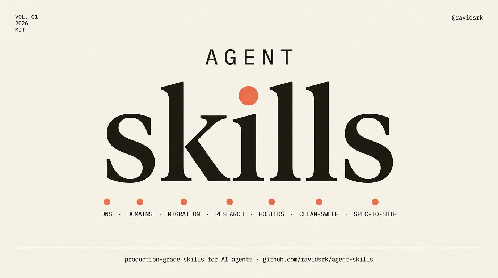

<h1 align="center">Agent Skills</h1>

<p align="center">
  <strong>Production-grade capability skills for AI agents.</strong><br/>
  DNS, AWS migration, deep research, terminal posters, and Orca multi-agent playbooks — battle-tested in production.
</p>

<p align="center">
  <a href="https://github.com/ravidsrk/agent-skills/blob/main/LICENSE"></a>
  <a href="https://agentskills.io/specification"></a>
  <a href="https://github.com/ravidsrk/agent-skills/stargazers"></a>
  <a href="https://github.com/ravidsrk/agent-skills/commits/main"></a>
</p>

<p align="center">
  
</p>

<p align="center"><sub>↑ Generated by Nano Banana Pro via OpenRouter. Prompt: <a href="scripts/banner/banner-prompt.txt">scripts/banner/banner-prompt.txt</a></sub></p>

---

# What's inside

50 skills, organized by what they do — not by SDLC phase. These are **discrete capabilities** an agent reaches for when the task fits, not lifecycle steps that fire in sequence.

# 🌐 Infrastructure

| Skill | What it does | Cost / latency |
|---|---|---|
| ☁️ **[cloudflare-dns](skills/cloudflare-dns/)** | End-to-end Cloudflare DNS migration and management. Move domains from any registrar, manage records via API, harden with DNSSEC + CAA + Origin CA, roll back cleanly. State persists in `./.dns-state/<domain>/` for reuse + rollback. | Free + ~5 min/domain |
| 🧾 **[namecheap-dns](skills/namecheap-dns/)** | Manage DNS records at Namecheap via the XML API — list, add, update, delete A/AAAA/CNAME/TXT/MX without the dashboard. Handles the two API quirks (IP allowlist, wholesale-replace `setHosts`) transparently. | Free + ~30s/change |
| 🚀 **[fly-to-aws-migration](skills/fly-to-aws-migration/)** | End-to-end playbook for migrating a Fly.io project to AWS. 7 phases, 5 PRs, full rollback preserved. Postgres → Aurora, Machines → ECS Fargate, static sites → S3+CloudFront, DNS cutover via Cloudflare. Battle-tested with ≤9 min total downtime. | ~6 hours, ~$330–640/mo target spend |

# 🔍 Research

| Skill | What it does | Cost / latency |
|---|---|---|
| 🔬 **[deep-research](skills/deep-research/)** | Parallel multi-source research orchestrator. Fans out across **8 sources** (X, Reddit, HN, GitHub repos + issues, Polymarket, YouTube with transcripts, Exa neural search) via [monid](https://monid.dev). One auth, one balance, structured + human-readable evidence dumps. | ~$0.10–0.20 + ~60–90s/run |

# 🎨 Creative

| Skill | What it does | Cost / latency |
|---|---|---|
| 🎨 **[terminal-poster](skills/terminal-poster/)** | Generates dense, retro-cyberpunk infographic posters in a terminal aesthetic — pixel-bitmap headlines, ASCII box-drawing, monospace fonts. Five reusable templates (Cluster A–E). Cluster A audited at 99% fidelity. | ~$0.002 + ~30s/image |

# 🤖 Multi-agent orchestration (Orca)

### Architecture (all multi-agent skills)

```
Orca runtime + orchestration skill   ← HARD BASE (from Orca CLI; not this repo)
        │
        ├── clean-sweep / spec-to-ship     (this pack — product/audit peers)
        └── matt-ship / wayfinder-fleet / … (this pack — Matt×Orca peers)
                │
                └── worker playbooks: mattpocock/skills (/implement, /tdd, …)
```

**We use Orca — we do not replace it.** Nothing multi-agent here runs without Orca orchestration. Matt skills are *what workers run*; Orca is *how the coordinator dispatches, waits, and gates*. MOST skills in this pack do **not** depend on each other at runtime (e.g. clean-sweep is not built on matt-ship) — the exceptions are the composers, declared per skill and in the [runtime dependency matrix](AGENTS.md#runtime-dependency-matrix): `full-sprint-fleet` (composes plan/build/verify/ship fleets), `spec-issue-fleet` (Matt ticketing + matt-ship phases), `investigate-fleet` (Matt `/tdd`), `architecture-sprint` (design-it-thrice + matt-ship), `triage-to-fleet` (ready-agent-drain).


All require **Orca + `orchestration` skill (Orca CLI)**. Matt×Orca skills also need [mattpocock/skills](https://github.com/mattpocock/skills). Shared helpers: [`scripts/orca-coord/`](scripts/orca-coord/).

### Autonomous missions (goal in → finished outcome out)

Give it a goal, come back to an evidence-based end state. Each is a deep mission that loops
until done: discovery → PR-per-finding on an integration branch → build-blind review →
merge-train → verify → repeat-until-dry. Human gates only at scope freeze, one-way
decisions, and BASE→default promotion. Worker methodology is drawn from one upstream pack
per worker (Matt / gstack / Addy — never two routers in a single worker TASK).

| Mission | End state (definition of done) |
|---|---|
| 🚢 **[spec-to-ship](skills/spec-to-ship/)** | Frozen spec → shipped product (PR-per-task). Whole-product. |
| 🧹 **[clean-sweep](skills/clean-sweep/)** | Every real audit finding closed. Peer of spec-to-ship. |
| 🗂️ **[backlog-zero](skills/backlog-zero/)** | The tracker is empty or every survivor is parked with a reason |
| 🛡️ **[red-team-harden](skills/red-team-harden/)** | A fresh full audit finds zero unrefuted P0/P1 (fix, then re-attack) |
| 🎯 **[flake-zero](skills/flake-zero/)** | The suite passes N consecutive green runs, no retry-wrappers |
| 🏭 **[feature-factory](skills/feature-factory/)** | One grill in → a shipped feature behind the promotion gate |

### Fleet ops (runtime-native autonomy layer)

Built directly on Orca primitives no other skill exploited — automations, provenance, merge_ready, gates. No gstack or Matt dependency.

| Skill | What it does |
|---|---|
| ⏰ **[standing-fleet](skills/standing-fleet/)** | Schedule any fleet on `orca automations`: prechecks skip empty runs, parked gates carry across runs |
| 🩺 **[fleet-doctor](skills/fleet-doctor/)** | Detect stalled dispatches, respawn fresh terminals, circuit-breaker escalation |
| 📦 **[run-blackbox](skills/run-blackbox/)** | Status / crash-resume / audit from the runtime's persisted provenance |
| 🚪 **[gate-steward](skills/gate-steward/)** | Mechanical gates auto-resolved (audited), taste batched, one-way human-only |
| 🚂 **[merge-train](skills/merge-train/)** | Serialized merge queue on `merge_ready` with reviewed-SHA freshness |
| 🗳️ **[quorum](skills/quorum/)** | Group fan-out votes with auditable consensus tables; JURY mode for model-jury |
| ✂️ **[spec-decompose](skills/spec-decompose/)** | Spec → tracer-bullet task DAG for `orchestration run` (the missing decomposition) |
| 🫧 **[ephemeral-fleet](skills/ephemeral-fleet/)** | Disposable sandbox workers; the only sanctioned home for danger-profile work |
| 🧠 **[fleet-memory](skills/fleet-memory/)** | Compounding learnings injected into future dispatches + adaptive review gating |

### Matt × Orca (engineering process on a fleet)

Coding flow (Matt v1.1+): **`/wayfinder` → `/to-spec` → `/to-tickets` → `/implement`** (AFK fleet). Do not use wayfinder as the entire coding path.

| Skill | What it does |
|---|---|
| 🧭 **[wayfinder-fleet](skills/wayfinder-fleet/)** | Parallel AFK wayfinder tickets; **coding exits to to-spec → tickets → implement** |
| 🚢 **[matt-ship](skills/matt-ship/)** | Full Matt main flow on Orca: grill → to-spec → tickets → fleet implement → dual review |
| 📬 **[triage-to-fleet](skills/triage-to-fleet/)** | Parallel triage verify → human gates → optional implement |
| 📥 **[ready-agent-drain](skills/ready-agent-drain/)** | Drain `ready-for-agent` queue with capped workers |
| 🧪 **[review-matrix](skills/review-matrix/)** | Parallel Standards + Spec (+ optional security/test) review wall |
| ⚔️ **[adversarial-ticket](skills/adversarial-ticket/)** | Red-team ticket acceptance after implement |
| 🐛 **[diagnose-swarm](skills/diagnose-swarm/)** | Repro → fix+tdd → review for hard bugs |
| 🏗️ **[architecture-sprint](skills/architecture-sprint/)** | Deepening survey → tickets → implement |
| 🪞 **[design-it-thrice](skills/design-it-thrice/)** | 3+ isolated radical interface designs |
| 🔬 **[research-then-grill](skills/research-then-grill/)** | Parallel research pack → grounded grill |
| ⚖️ **[model-jury](skills/model-jury/)** | Multi-model independent implement + pick |
| 📚 **[content-wayfinder](skills/content-wayfinder/)** | Non-coding wayfinder full journey (courses) |

### Gstack × Orca (autonomous role fleets)

Methodology from [garrytan/gstack](https://github.com/garrytan/gstack); **runtime is Orca** (we use it, we do not replace it). Workers load gstack skills for playbooks.

| Skill | What it does |
|---|---|
| 🚢 **[gstack-ship-fleet](skills/gstack-ship-fleet/)** | Tests → review → open PR (ship factory) |
| 🧪 **[qa-fleet](skills/qa-fleet/)** | Parallel browse QA axes (report or fix budget) |
| 🔒 **[cso-fleet](skills/cso-fleet/)** | OWASP/STRIDE audit → PR-per-finding fixes |
| 📋 **[autoplan-fleet](skills/autoplan-fleet/)** | CEO→design→eng→DX plan gauntlet (fresh contexts) |
| 🔍 **[review-prod-fleet](skills/review-prod-fleet/)** | Prod-bug class parallel review |
| ❤️ **[health-fleet](skills/health-fleet/)** | Typecheck/lint/tests/dead-code dashboard |
| 📚 **[docs-fleet](skills/docs-fleet/)** | document-generate + document-release |
| 🐛 **[investigate-fleet](skills/investigate-fleet/)** | gstack RCA swarm |
| 🐤 **[canary-fleet](skills/canary-fleet/)** | Post-deploy monitor (no silent rollback) |
| ⚡ **[benchmark-fleet](skills/benchmark-fleet/)** | Perf / CWV vs baseline |
| 📅 **[retro-cron](skills/retro-cron/)** | Weekly eng retro batch |
| 📱 **[ios-qa-fleet](skills/ios-qa-fleet/)** | Real-device iOS QA/fix |
| 💬 **[office-hours-async](skills/office-hours-async/)** | Six questions async + research prep |
| 🎨 **[design-shotgun-fleet](skills/design-shotgun-fleet/)** | Parallel UI variants → human pick |
| 📝 **[spec-issue-fleet](skills/spec-issue-fleet/)** | gstack /spec → issue → implement |
| 🏁 **[full-sprint-fleet](skills/full-sprint-fleet/)** | Plan→build→verify→ship coordinator |
| 🛡️ **[guard-policy](skills/guard-policy/)** | careful/freeze/guard on all workers |
| 🤖 **[headless-mode](skills/headless-mode/)** | AUTO_DECIDE · no AskUserQuestion |


---

# Quick Start

## Install matrix

| Track | Skills | Extra runtime |
|---|---|---|
| **A — Capability** (any agent harness) | `cloudflare-dns`, `namecheap-dns`, `fly-to-aws-migration`, `deep-research`, `terminal-poster` | Env keys only (see below) |
| **B — Orca multi-agent** | `clean-sweep`, `spec-to-ship` | Orca + `orchestration` (Orca CLI). Peers; neither depends on the other. |
| **F — Autonomous missions** | `backlog-zero`, `red-team-harden`, `flake-zero`, `feature-factory` | Orca + `orchestration` + ONE worker pack per mission (mattpocock/skills, garrytan/gstack, or [addyosmani/agent-skills](https://github.com/addyosmani/agent-skills)); compose in-pack fleet-ops. |
| **E — Fleet ops** | `standing-fleet`, `fleet-doctor`, `run-blackbox`, `gate-steward`, `merge-train`, `quorum`, `spec-decompose`, `ephemeral-fleet`, `fleet-memory` | Orca + `orchestration` (Orca CLI) only (`ephemeral-fleet` also needs `orca-per-workspace-env` recipes). Compose with any fleet. |
| **D — Gstack × Orca** | `gstack-ship-fleet`, `qa-fleet`, `cso-fleet`, `autoplan-fleet`, `review-prod-fleet`, `health-fleet`, `docs-fleet`, `investigate-fleet`, `canary-fleet`, `benchmark-fleet`, `retro-cron`, `ios-qa-fleet`, `office-hours-async`, `design-shotgun-fleet`, `spec-issue-fleet`, `full-sprint-fleet`, `guard-policy`, `headless-mode` | Orca + `orchestration` + **garrytan/gstack** for worker playbooks. `investigate-fleet`, `spec-issue-fleet`, `full-sprint-fleet` ALSO need **mattpocock/skills** (Track C). |
| **C — Matt × Orca** | `matt-ship`, `wayfinder-fleet`, `triage-to-fleet`, `ready-agent-drain`, `review-matrix`, `adversarial-ticket`, `diagnose-swarm`, `architecture-sprint`, `design-it-thrice`, `research-then-grill`, `model-jury`, `content-wayfinder` | Orca + `orchestration` + **mattpocock/skills** for worker playbooks. |

🟡 **Name collision:** this repo's `deep-research` is the **monid 8-source** orchestrator. Other skill packs (e.g. makerskills) may ship a different skill with the same name. Symlinking this repo's copy will replace the other under `~/.claude/skills/deep-research`. Keep makerskills under `~/.agents/skills/` if you need both.

<details>
<summary><b>🟢 Claude Code (recommended)</b></summary>

```bash
git clone https://github.com/ravidsrk/agent-skills.git
cd agent-skills

mkdir -p ~/.claude/skills
# Track A only (safe default if you already have another deep-research):
for name in cloudflare-dns namecheap-dns fly-to-aws-migration terminal-poster; do
  ln -sfn "$(pwd)/skills/$name" "$HOME/.claude/skills/$name"
done
# monid deep-research (overwrites any other skill at this path):
ln -sfn "$(pwd)/skills/deep-research" "$HOME/.claude/skills/deep-research"

# Track B — Orca peers (no Matt dependency):
for name in clean-sweep spec-to-ship; do
  ln -sfn "$(pwd)/skills/$name" "$HOME/.claude/skills/$name"
done

# Track F — Autonomous missions (install ONE worker pack per mission; never two routers in one worker):
for name in backlog-zero red-team-harden flake-zero feature-factory; do
  ln -sfn "$(pwd)/skills/$name" "$HOME/.claude/skills/$name"
done

# Track E — Fleet ops (Orca only):
for name in standing-fleet fleet-doctor run-blackbox gate-steward merge-train \
  quorum spec-decompose ephemeral-fleet fleet-memory; do
  ln -sfn "$(pwd)/skills/$name" "$HOME/.claude/skills/$name"
done


# Track D — Gstack × Orca. These wrappers RUN gstack methods in workers — install gstack too:
[ -d ~/.claude/skills/gstack ] || git clone https://github.com/garrytan/gstack.git ~/.claude/skills/gstack
(cd ~/.claude/skills/gstack && git pull --ff-only && ./setup)
for name in gstack-ship-fleet qa-fleet cso-fleet autoplan-fleet review-prod-fleet \
  health-fleet docs-fleet investigate-fleet canary-fleet benchmark-fleet retro-cron \
  ios-qa-fleet office-hours-async design-shotgun-fleet spec-issue-fleet full-sprint-fleet \
  guard-policy headless-mode; do
  ln -sfn "$(pwd)/skills/$name" "$HOME/.claude/skills/$name"
done
# investigate-fleet + spec-issue-fleet + full-sprint-fleet ALSO need the Matt skills from Track C.

# Track C — Matt × Orca. Workers run Matt playbooks — install them (executed, not optional):
npx skills add mattpocock/skills -y
for name in matt-ship wayfinder-fleet design-it-thrice review-matrix triage-to-fleet \
  diagnose-swarm architecture-sprint research-then-grill adversarial-ticket \
  content-wayfinder model-jury ready-agent-drain; do
  ln -sfn "$(pwd)/skills/$name" "$HOME/.claude/skills/$name"
done
```

Symlinks mean `git pull` in this clone keeps skills up to date. Shared coordinator helpers: `scripts/orca-coord/`.

📖 **Full guide:** [docs/claude-code-setup.md](docs/claude-code-setup.md)

</details>

<details>
<summary><b>🟢 Mogra</b></summary>

```bash
cd /workspace
git clone https://github.com/ravidsrk/agent-skills.git

mkdir -p /workspace/.mogra/skills
for s in agent-skills/skills/*/; do
  name=$(basename "$s")
  ln -sf "$(pwd)/$s" "/workspace/.mogra/skills/$name"
done
```

Restart your Mogra session and the skills appear.

📖 **Full guide:** [docs/mogra-setup.md](docs/mogra-setup.md)

</details>

<details>
<summary><b>🟡 Cursor</b></summary>

Per-project install — copy `SKILL.md` into `.cursor/rules/`:

```bash
mkdir -p .cursor/rules
cp /path/to/agent-skills/skills/cloudflare-dns/SKILL.md .cursor/rules/cloudflare-dns.md
```

📖 **Full guide:** [docs/cursor-setup.md](docs/cursor-setup.md)

</details>

<details>
<summary><b>🟡 OpenCode</b></summary>

OpenCode reads `AGENTS.md` and the `skills/` directory automatically:

```bash
git clone https://github.com/ravidsrk/agent-skills.git ~/.opencode/agent-skills
ln -s ~/.opencode/agent-skills/skills ~/.opencode/skills
```

📖 **Full guide:** [docs/opencode-setup.md](docs/opencode-setup.md)

</details>

<details>
<summary><b>🟡 Codex / GitHub Copilot / any other agent</b></summary>

Skills are plain Markdown — they work with any agent that accepts system prompts or instruction files.

For Copilot, concatenate skills into `.github/copilot-instructions.md`:

```bash
cat skills/cloudflare-dns/SKILL.md \
    skills/namecheap-dns/SKILL.md \
    > .github/copilot-instructions.md
```

📖 **Full guide:** [docs/generic-setup.md](docs/generic-setup.md)

</details>

# Set the env vars

Each skill needs different secrets. Set them in your shell — never paste into prompts.

```bash
# cloudflare-dns
export CLOUDFLARE_API_KEY=cfat_...
export CLOUDFLARE_GLOBAL_API_KEY=...    # only for new-zone creation
export CLOUDFLARE_EMAIL=you@example.com

# namecheap-dns
export NAMECHEAP_API_KEY=...
export NAMECHEAP_API_USER=your-account

# fly-to-aws-migration
export AWS_PROFILE=migration
export FLY_API_TOKEN=...
# (also uses CLOUDFLARE_API_KEY for the DNS cutover phase)

# deep-research
export MONID_API_KEY=...

# terminal-poster
export OPENROUTER_API_KEY=...

# clean-sweep / spec-to-ship — no API keys; need Orca runtime + orchestration skill (from Orca CLI)
# orca status --json   # must show running; enable orchestration in Experimental settings
```

🔴 **All skills read env vars at runtime — they're never written to disk.** Don't commit `.env` files.

---

# Try it

Skills auto-activate based on the `description` field in their `SKILL.md`. Just ask the agent for what you want.

> 💬 *"Move example.com's DNS to Cloudflare"* → activates `cloudflare-dns`
>
> 💬 *"Add a CNAME for docs.example.com pointing at my Fly app"* → activates `namecheap-dns`
>
> 💬 *"Migrate my Fly project to AWS"* → activates `fly-to-aws-migration`
>
> 💬 *"Do a deep dive on AI agent harness engineering"* → activates `deep-research` (monid)
>
> 💬 *"Generate a terminal-style poster for our deployment pipeline"* → activates `terminal-poster`
>
> 💬 *"The docs are ready — build the whole product"* → activates `spec-to-ship` (Orca)
>
> 💬 *"Clean sweep the issues in this audit"* → activates `clean-sweep` (Orca)
>
> 💬 *"Grill this idea then fleet-implement the tickets"* → activates `matt-ship` (Matt×Orca)
>
> 💬 *"Chart a wayfinder map then research in parallel"* → activates `wayfinder-fleet`

---

# Preview gallery

<a href="skills/terminal-poster/README.md#live-examples">
  
  
  
</a>

Three real first-generation outputs from `terminal-poster`. [Audit scores + how to reproduce →](skills/terminal-poster/README.md#live-examples)

---

# How skills work

Every skill follows the same anatomy:

```
┌─────────────────────────────────────────────────┐
│  SKILL.md                                       │
│                                                 │
│  ┌─ Frontmatter ─────────────────────────────┐  │
│  │ name: lowercase-hyphen-name               │  │
│  │ description: Does X. Use when…            │  │
│  │ compatibility: needs $ENV_VAR, bash, curl │  │
│  └───────────────────────────────────────────┘  │
│                                                 │
│  Overview         → What this skill does        │
│  When to use      → Triggering conditions       │
│  Setup            → Env vars + dependencies     │
│  Workflow         → Step-by-step process        │
│  Gotchas          → Known traps + fixes         │
└─────────────────────────────────────────────────┘
```

**Key design choices:**

- 🟢 **Process, not prose.** Skills are workflows agents follow, not reference docs they read.
- 🟢 **Spec-compliant.** Every skill validates against the [agentskills.io](https://agentskills.io/specification) format.
- 🟢 **Battle-tested.** These are the actual tools used in production, not theoretical patterns.
- 🟢 **Progressive disclosure.** `SKILL.md` is the entry point. References load on demand to keep token usage low.
- 🟢 **Capability-first, not SDLC-first.** Unlike skill packs that map to DEFINE → PLAN → BUILD → SHIP, these are discrete tools. Pick what you need.

📖 Full spec: [docs/skill-anatomy.md](docs/skill-anatomy.md)

---

# Project Structure

```
agent-skills/
├── README.md                     ← You are here
├── AGENTS.md                     ← Runtime-agnostic agent guidance
├── CLAUDE.md                     ← Claude Code session context
├── CONTRIBUTING.md               ← How to add a skill
├── LICENSE                       ← MIT
├── plugin.json                   ← Claude Code plugin manifest
├── assets/
│   └── banner.png                ← Hero image (generated by terminal-poster)
├── docs/                         ← Per-runtime setup + format spec
│   ├── getting-started.md
│   ├── skill-anatomy.md
│   ├── claude-code-setup.md
│   ├── mogra-setup.md
│   ├── cursor-setup.md
│   ├── opencode-setup.md
│   └── generic-setup.md
├── scripts/
│   └── validate-skills.py        ← Validates SKILL.md against the spec
└── skills/
    ├── cloudflare-dns/           ← 🌐 DNS migration + zone hardening
    ├── namecheap-dns/            ← 🌐 Namecheap XML API wrapper
    ├── fly-to-aws-migration/     ← 🌐 Fly → AWS playbook (7 phases)
    ├── deep-research/            ← 🔍 8-source parallel research
    └── terminal-poster/          ← 🎨 Retro-cyberpunk image posters
```

Each skill folder contains:

- `SKILL.md` — Agent-facing manifest (frontmatter + workflow)
- `README.md` — Human install + usage docs
- `scripts/` — Runnable helpers (optional)
- `references/` — Long-form docs loaded on demand (optional)
- `templates/` — Boilerplate users copy into their projects (optional)
- `assets/` — Example outputs, fixtures (optional)

---

# Validation

Every push runs the validator. Run it locally before committing:

```bash
python3 scripts/validate-skills.py
```

Output:

```
✅ cloudflare-dns
✅ deep-research
✅ fly-to-aws-migration
✅ namecheap-dns
✅ terminal-poster

🟢 All 50 skills valid against agentskills.io spec.
```

The validator enforces the spec rules (frontmatter shape, name/directory matching, description length). Non-zero exit code if any skill fails — perfect for CI.

---

# Why this repo exists

Most agent skill packs are shaped like a software lifecycle — DEFINE → PLAN → BUILD → SHIP. That's useful for skills that encode process discipline (writing specs, doing TDD, reviewing code).

This repo is shaped differently. These are **capability skills** — tools the agent reaches for when the task fits. You don't migrate to AWS as part of a SDLC phase; you migrate when you migrate. You don't run deep research because the workflow says so; you run it when you need evidence.

The two styles are complementary. For SDLC discipline, [addyosmani/agent-skills](https://github.com/addyosmani/agent-skills) is excellent. For real-world infrastructure and content tooling, this repo is what I reach for.

The shared bet: **portable, public, spec-compliant** skills make agents better.

---

# Contributing

PRs welcome — new skills, fixes to existing ones, better docs. Quality bar:

- 🟢 **Specific:** actionable steps, not vague advice
- 🟢 **Verifiable:** clear exit criteria with evidence requirements
- 🟢 **Battle-tested:** based on real workflows you've shipped
- 🟢 **Minimal:** only what's needed to guide the agent

📖 See [CONTRIBUTING.md](CONTRIBUTING.md) and [docs/skill-anatomy.md](docs/skill-anatomy.md).

**TL;DR:** create `skills/<your-skill>/SKILL.md` + `README.md`, run `python3 scripts/validate-skills.py`, update the skills table, open a PR.

---

# Credits

- 🏗️ **Repo structure** — inspired by [addyosmani/agent-skills](https://github.com/addyosmani/agent-skills). The plugin manifest pattern, multi-runtime setup docs, expandable installs, and `AGENTS.md` conventions came from there.
- 🎨 **`terminal-poster`** — visual pattern reverse-engineered from public posts by [@shannholmberg](https://x.com/shannholmberg) on X. The skill makes the look reproducible across topics; Shann designed the look itself.
- 🔍 **`deep-research`** — originally inspired by [`mvanhorn/last30days-skill`](https://github.com/mvanhorn/last30days-skill). The 30-day default window came from that upstream; the 8-source fan-out and monid routing were rebuilt from scratch.

---

# License

[MIT](LICENSE) © [@ravidsrk](https://github.com/ravidsrk)

If you build something with these skills, I'd love to see it — tag me on [X](https://x.com/ravidsrk) or open an issue.
