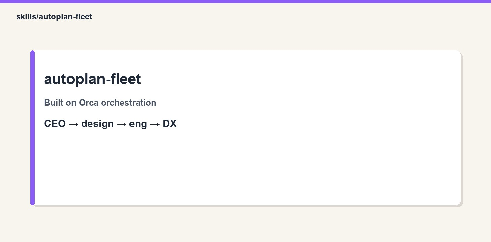

# autoplan-fleet

<p align="center">
  
</p>

Run gstack autoplan methodology as an Orca DAG: sequential CEO, design, eng, DX plan reviews in fresh worker contexts with AUTO_DECIDE for mechanical choices and human gates for taste or premises.

## Hard base: Orca (we use it — we do not replace it)

| Need | Source |
|------|--------|
| Runtime + dispatch + `worker_done` | **Orca** |
| Command grammar | **`orchestration` skill (Orca CLI)** |
| This playbook | `SKILL.md` |
| Worker methodology | [garrytan/gstack](https://github.com/garrytan/gstack) (+ Matt skills where noted) |

## Install

```bash
git clone https://github.com/ravidsrk/agent-skills.git
ln -sfn "$(pwd)/agent-skills/skills/autoplan-fleet" ~/.claude/skills/autoplan-fleet

# gstack for workers (methodology):
git clone --depth 1 https://github.com/garrytan/gstack.git ~/.claude/skills/gstack
(cd ~/.claude/skills/gstack && ./setup)

orca status --json   # must be running
```

## Layout

`SKILL.md` · `scripts/` (spawn/preflight/pm) · `assets/` (preambles) · `references/ledger-template.md`

## Related

See `full-sprint-fleet` for end-to-end composition. Peers: `matt-ship`, `spec-to-ship`, `clean-sweep`.
