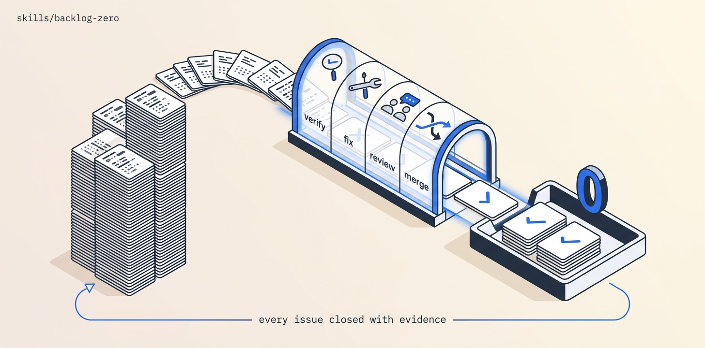

# Backlog-Zero

Give it a tracker, come back to an empty one. Every open issue is triage-verified (reproduced or refuted with evidence), every real bug fixed PR-per-issue with a failing-first test, build-blind reviewed, merge-trained, and closed with a linked merge SHA — looping until a full enumeration comes back dry. Human gates only for closing refutations and the BASE→default promotion.

## Install

```bash
ln -sfn "$(pwd)/skills/backlog-zero" "$HOME/.claude/skills/backlog-zero"
```
Requires Orca + `orchestration`, git + gh (or Linear), and ONE worker-playbook pack (mattpocock/skills or addyosmani/agent-skills — never two routers in one worker).

## Use

"Drain the backlog on ravidsrk/foo, integration branch fix/backlog-drain, max 4 workers." → enumerate, verify, fix, review, merge, close, re-enumerate until dry. The evidence-based end state ("every issue closed with a merged fix + a test that failed pre-fix, or refuted, or parked with a reason") is the definition of done, not "workers ran".

## Structure

```
backlog-zero/
├── SKILL.md          # the mission playbook — read top to bottom
├── README.md
├── scripts/          # spawn_worker (calls Orca) · preflight (git/gh) · pm (JSON parser)
├── assets/           # banner + reproducer prompt
└── references/       # ledger template
```

The `scripts/` helpers are GENERATED from this repo's `scripts/orca-coord/` — edit the
canonical files and run `python3 scripts/sync-orca-coord.py`, never the copies.

## License

MIT
