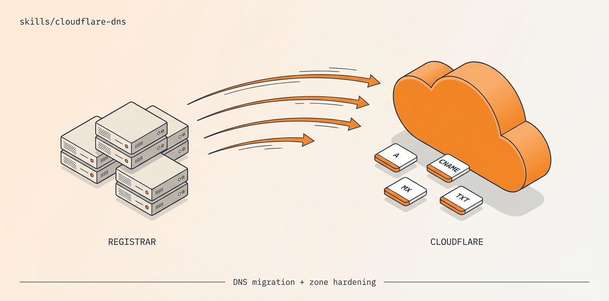

# cloudflare-dns

<p align="center">
  
</p>

**End-to-end DNS migration and management for Cloudflare.** Move domains from any registrar to Cloudflare, manage records via API, harden zones with DNSSEC + CAA + Origin CA, and roll back cleanly if anything goes wrong.

🟢 **Auth:** account-scoped API token (`CLOUDFLARE_API_KEY`) + global key (`CLOUDFLARE_GLOBAL_API_KEY` + `CLOUDFLARE_EMAIL`, only for new-zone creation)
🟢 **Idempotent:** every script can be re-run; state persists in `./.dns-state/<domain>/`
🟢 **Reversible:** `rollback.sh` restores nameservers + saves pre-migration audit state

# What it does

Cloudflare's REST API surface is wide but uneven — different scopes for different endpoints, no native bulk import, and DNS propagation is its own minefield. This skill wraps the common operations into idempotent scripts:

| Script | What it does |
|---|---|
| `audit.sh` | Snapshots current DNS state from the source registrar (records + nameservers) into `./.dns-state/<domain>/audit-pre.json` — your rollback insurance |
| `migrate.sh` | Full migration flow: create zone → import records → verify → flip nameservers at the registrar → poll propagation |
| `harden.sh` | Layers on CAA records, DMARC monitor, Cloudflare WAF rate-limiting rules, and a hardening checklist |
| `dnssec-instructions.sh` | Generates step-by-step DS-record instructions for the registrar side (Namecheap's public API doesn't expose DNSSEC, so this stays manual) |
| `origin-ca.sh` | Issues a 15-year Origin CA cert + private key for use with Cloudflare's authenticated origin pulls |
| `dns-export.sh` | Exports the live zone to YAML / JSON / BIND zonefile / Terraform |
| `cf-ips-fetch.sh` | Fetches Cloudflare's official IP ranges (use for origin firewall rules) |
| `dns-direct-query.py` | Bypasses public resolvers — queries authoritative nameservers directly (essential during propagation debugging) |
| `rollback.sh` | Restores nameservers at the registrar from the saved audit |

# When to use it

The skill's `description` triggers on phrases like:

- *"Move my DNS to Cloudflare"*
- *"Add this domain to my Cloudflare account"*
- *"Manage Cloudflare DNS records via API"*
- *"Automate DNS setup for these N domains"*
- *"Why isn't my Cloudflare migration finishing?"* (propagation debugging)
- *"Harden my Cloudflare zone"*

# Install

# 1. Get the skill

```bash
git clone https://github.com/ravidsrk/agent-skills.git
ln -s "$(pwd)/agent-skills/skills/cloudflare-dns" ~/.claude/skills/cloudflare-dns
# Or your runtime's skill directory
```

# 2. Set environment variables

```bash
# Account-scoped API Token (used by default for record ops, zone listing, etc.)
# Create at: https://dash.cloudflare.com/profile/api-tokens
export CLOUDFLARE_API_KEY=cfat_...

# Global API Key (ONLY needed to create new zones — POST /zones requires user-scoped auth)
# Found at: https://dash.cloudflare.com/profile/api-tokens → API Keys → Global API Key
export CLOUDFLARE_GLOBAL_API_KEY=...
export CLOUDFLARE_EMAIL=you@example.com
```

🔴 **Security note.** `CLOUDFLARE_GLOBAL_API_KEY` grants full account access (billing, members, everything). Treat it like a root password — never write it to disk, configs, URLs, or git. The skill always reads it from env at call time.

# 3. If migrating from Namecheap

You'll also need the `namecheap-dns` skill installed and its env vars set — see [`skills/namecheap-dns/README.md`](../namecheap-dns/README.md). The `migrate.sh flip` step calls Namecheap's API to update nameservers.

# 4. Test it

```bash
cd skills/cloudflare-dns
scripts/audit.sh example.com
```

This is read-only — it just snapshots current state. Output goes to `./.dns-state/example.com/audit-pre.json`.

# Usage

# Full migration (interactive)

```bash
scripts/migrate.sh example.com full
```

Walks through every step with prompts. Use this the first few times.

# Step-by-step (scriptable)

```bash
scripts/migrate.sh example.com create     # create zone at Cloudflare
scripts/migrate.sh example.com import     # import all records from audit-pre.json
scripts/migrate.sh example.com verify     # query CF's nameservers to confirm
scripts/migrate.sh example.com flip       # update nameservers at Namecheap
scripts/migrate.sh example.com watch      # poll propagation until 10 resolvers see CF
```

# Hardening (after migration is live)

```bash
scripts/harden.sh example.com
```

Adds:
- CAA records (`letsencrypt.org`, `digicert.com`) — prevents rogue CAs issuing certs
- DMARC monitor (`v=DMARC1; p=none; rua=mailto:postmaster@example.com`) — passive email-spoofing visibility
- Cloudflare WAF rate-limiting rule (default `--rate-limit-rpm=300` → 50 req/10s per IP on `/api/*`)
- Bot Fight Mode, Always Use HTTPS, HSTS, Min TLS 1.2

# DNSSEC

```bash
scripts/dnssec-instructions.sh example.com
```

Cloudflare signs the zone instantly, but the DS record at the parent zone (`.com`, `.ai`, etc.) needs manual entry at most registrars. The script prints exact key tag / algorithm / digest values for paste.

# Origin CA cert (15-year)

```bash
scripts/origin-ca.sh example.com                       # ECC P-256, default
scripts/origin-ca.sh example.com --rsa                 # RSA-2048
scripts/origin-ca.sh example.com --validity-days=365   # 1-year instead of 15
scripts/origin-ca.sh example.com --hostnames=example.com,*.example.com,api.example.com
```

Cert + key saved to `./.dns-state/example.com/origin-ca/`. Lock down your origin to accept only certs signed by Cloudflare's Origin CA — defends against direct-to-origin attacks.

# Export the zone

```bash
scripts/dns-export.sh example.com                            # YAML (default)
scripts/dns-export.sh example.com --format=json              # raw API JSON
scripts/dns-export.sh example.com --format=zonefile          # BIND zonefile
scripts/dns-export.sh example.com --format=terraform         # cloudflare_record .tf
```

# Rollback

```bash
scripts/rollback.sh example.com
```

Reads `./.dns-state/example.com/audit-pre.json`, sets nameservers at Namecheap back to the original (`dns1/2.registrar-servers.com` by default).

🟡 **Note:** rollback restores nameservers *at the registrar*. Records previously held by the original DNS provider will be served again once propagation completes (5–30 min). The Cloudflare zone is NOT deleted — your records there are intact for re-flipping.

# Required Cloudflare token permissions

For the account-scoped `CLOUDFLARE_API_KEY`:

| Permission | Why |
|---|---|
| `Zone:Read` | List zones, check zone status |
| `DNS:Edit` | Create/update/delete records |
| `Zone Settings:Edit` | Toggle proxy, SSL mode, etc. |
| `Page Rules:Edit` | If using `harden.sh` |
| `Zone WAF:Edit` | Rate-limiting rules in `harden.sh` |
| `Origin CA:Write` | If using `origin-ca.sh` |

# Known gotchas

- 🟡 **Public resolvers cache stale NS answers up to 30 min** after nameserver flip — even when the parent TLD is already delegating to Cloudflare. Use `dns-direct-query.py` against the TLD's authoritative nameservers (e.g. `v0n0.nic.ai` for `.ai`) to verify ground truth.
- 🔴 **`POST /zones` requires Global API Key**, not the account token. Cloudflare's docs are misleading on this.
- 🟡 **Proxy ON + non-Cloudflare CA = cert issuance failures.** The `harden.sh` CAA records (`letsencrypt.org`, `digicert.com`) cover both proxied and unproxied paths.
- 🟡 **Email forwarding from Namecheap doesn't survive a flip** — MX `eforward1-5.registrar-servers.com` records only work while the domain's NS points at Namecheap. After migration, set up Cloudflare Email Routing instead (the `migrate.sh import` step warns about this).

# File layout

```
cloudflare-dns/
├── SKILL.md              ← Manifest + full procedural docs (agent reads this)
├── README.md             ← This file (humans installing the skill)
└── scripts/
    ├── audit.sh                   ← Snapshot pre-migration state
    ├── migrate.sh                 ← Full migration orchestrator
    ├── harden.sh                  ← CAA, DMARC, WAF rules
    ├── dnssec-instructions.sh     ← Generate DS-record paste for registrar
    ├── origin-ca.sh               ← Issue 15-year Origin CA cert
    ├── dns-export.sh              ← Zone → YAML/JSON/zonefile/Terraform
    ├── cf-ips-fetch.sh            ← Pull Cloudflare's official IP ranges
    ├── dns-direct-query.py        ← Query nameservers directly (bypass resolvers)
    ├── rollback.sh                ← Restore original nameservers
    ├── fly-restrict-origin.md     ← Notes on locking down Fly origins behind CF
    └── lib.sh                     ← Shared helpers (auth, state dirs)
```

# Pairs with

- 🔗 **[`namecheap-dns`](../namecheap-dns/)** — needed for the nameserver flip step if migrating from Namecheap
- 🔗 **[`fly-to-aws-migration`](../fly-to-aws-migration/)** — uses this skill for the DNS cutover phase

# License

MIT.
