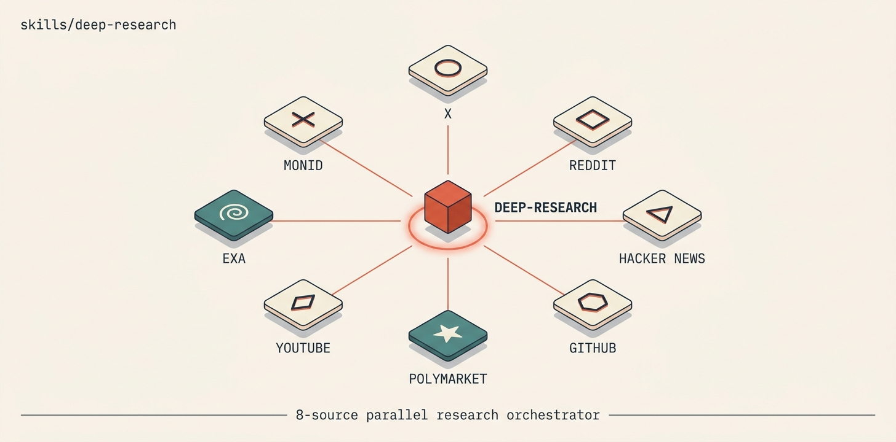

# deep-research

<p align="center">
  
</p>

A parallel multi-source deep-research orchestrator. Fans out across **8 data sources** in parallel and dumps quotable evidence as JSON + human-readable markdown in a single command.

🟢 **Cost:** ~$0.10–0.20 per run at default depth
🟢 **Auth:** one key (`MONID_API_KEY`) — every source routes through [monid](https://monid.dev)
🟢 **Output:** raw evidence ready to read and synthesize — never voiced, never opinionated

# What it does

Give it a topic. It runs 8 lookups in parallel:

| Source | What you get |
|---|---|
| 🐦 **X / Twitter** | Verbatim tweets with real engagement (likes/RT/replies/views), ranked by engagement |
| 🤖 **Reddit** | Operator/user opinion threads with top comments |
| 🧠 **Hacker News** | Developer-community discussion via Algolia |
| 📦 **GitHub repos** | Star counts, release dates, license, related projects |
| 🐛 **GitHub issues/PRs** | Active development threads, contested features, recent bugs |
| 💰 **Polymarket** | Money-weighted predictions on outcomes |
| 📺 **YouTube** | Recent videos + full transcripts for the top N (game-changing for talk-driven topics) |
| 🌐 **Exa neural web search** | Recent grounded web content + research papers |

Then it writes two files into `./research/<slug>/`:

- `research-<date>.md` — human-readable, sorted by engagement, scan-first
- `research-<date>.json` — full structured evidence, pull verbatim quotes from here

# When to use it

- Before writing any long-form artifact (briefing, post, report, memo)
- When the user asks "what's the discourse on X" or "do a deep dive on Y"
- When you need cross-source convergence to validate a thesis (if Reddit + HN + X all surface the same pattern, that's a real signal)

# Install

# 1. Clone the repo (if you haven't already)

```bash
git clone https://github.com/ravidsrk/agent-skills.git
cd agent-skills
```

# 2. Install the `monid` CLI

```bash
# Global install
npm install -g monid

# Or local (the skill auto-discovers ./node_modules/.bin/monid)
cd skills/deep-research && npm install monid
```

Get a `MONID_API_KEY` at [monid.dev](https://monid.dev) and export it:

```bash
export MONID_API_KEY=your_key_here
```

# 3. Symlink the skill into your agent runtime

```bash
# Claude Code / generic
ln -s "$(pwd)/skills/deep-research" ~/.claude/skills/deep-research

# Mogra
ln -s "$(pwd)/skills/deep-research" /workspace/.mogra/skills/deep-research
```

# 4. Test it

```bash
cd skills/deep-research/scripts
python3 research.py "agent harness engineering" --depth=quick
```

After ~30 seconds you'll have `./research/agent-harness-engineering/research-<date>.md` to scan.

# Usage

```bash
cd skills/deep-research/scripts

# Standard pre-flight (~$0.10–0.20, default 30-day window)
python3 research.py "agent harness engineering"

# Quick scan (~30s, smaller per-source limits)
python3 research.py "Stripe Sessions 2026 announcements" --depth=quick

# Deep dive (~3–4 min, deeper limits, more transcripts)
python3 research.py "openai vs anthropic enterprise 2026" --depth=deep --yt-transcripts=4

# Specific sources only
python3 research.py "Mitchell Hashimoto" --sources=x,github_repos,github_issues,hn

# Short window for news-shape topics
python3 research.py "GPT-5.5 launch" --days=7

# Custom output directory
python3 research.py "claude code skills" --out=/path/to/my/research/
```

# Flags

| Flag | Default | Notes |
|---|---|---|
| `--depth` | `default` | One of `quick`, `default`, `deep` |
| `--days` | `30` | Time window (in days) |
| `--sources` | all 8 | Comma-separated subset: `x,reddit,hn,github_repos,github_issues,polymarket,youtube,exa` |
| `--yt-transcripts` | `2` | Number of YouTube transcripts to pull (each costs ~$0.0075) |
| `--out` | `./research/<slug>/` | Custom output directory |

# Cost breakdown

| Source | Approx cost |
|---|---|
| X / Twitter | ~$0.003 (default depth, 2 pages) |
| Reddit | ~$0.05–0.10 per run |
| Hacker News | ~$0.0022 / call |
| GitHub repos | ~$0.0022 / call |
| GitHub issues | ~$0.0022 / call |
| Polymarket | ~$0.0022 / call |
| YouTube | ~$0.005/result + $0.0075/transcript |
| Exa | ~$0.011 / call |
| **Total** | **~$0.10–0.20** per default run |

# Voice contract

🔴 **This skill produces research input, not draft output.**

Never copy/paste sentences from `research-<date>.md` into the artifact you're writing. Always pull the *underlying primary source* (tweet text, blog excerpt, GitHub description) from the `.json` and synthesize in your own voice downstream.

If the script ever starts emitting *"the takeaway is..."* or *"the bottom line:"*, that's a bug. The synthesis is what humans (or downstream editorial workflows) do.

# How it's wired

Every source routes through the [`monid`](https://monid.dev) CLI for one auth + one balance:

- **Native monid endpoints** (X via tikhub, Reddit + YouTube via Apify, Exa via blockrun.ai) — direct calls
- **No native endpoint** (HN Algolia, GitHub REST, Polymarket Gamma) — proxied through `blockrun.ai/api/v1/exa/contents`, which returns the upstream JSON body verbatim for ~$0.0022/call

🔴 **Important:** do NOT proxy JSON through `surf/web/fetch` — its markdown cleaner mangles embedded URLs and produces invalid JSON. Use `exa/contents` (raw passthrough). The shared `_monid.fetch_json()` helper already does this correctly.

# Files

```
deep-research/
├── SKILL.md                          ← Skill manifest (agentskills.io spec)
├── README.md                         ← This file
├── assets/
│   ├── banner.jpg                    ← Skill banner
│   └── banner-prompt.txt             ← Banner reproducer
└── scripts/
    ├── research.py                   ← CLI entry point
    └── sources/
        ├── _monid.py                 ← Shared monid runner (auth, retries, JSON proxy)
        ├── x_twitter.py
        ├── reddit.py
        ├── hackernews.py
        ├── github.py
        ├── polymarket.py
        ├── youtube.py
        └── exa.py
```

# Adding a new source

1. `monid discover` to find the right provider
2. `monid inspect <provider> <endpoint>` to see the schema
3. Write a thin `sources/<name>.py`:
   - **Native endpoint:** import `run_monid` from `_monid` and pass `body=`, `query=`, or `path=`
   - **Arbitrary REST JSON:** import `fetch_json` from `_monid` (proxies through `exa/contents`)
4. Wire it into `research.py`'s source dispatcher

Treat `SKILL.md` and this README as living specs — bump the gotchas table when an upstream schema changes.

# Pairs with

- [`terminal-poster`](../terminal-poster/) — turn research findings into a shareable terminal-aesthetic poster.

# Credits

Originally inspired by [`mvanhorn/last30days-skill`](https://github.com/mvanhorn/last30days-skill). The 30-day default window came from that upstream; the 8-source fan-out, monid routing, and per-source modules were rebuilt from scratch.

Licensed under MIT.
