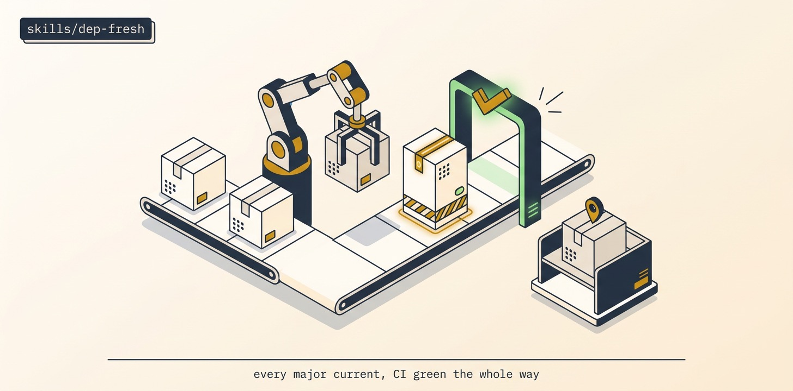

# Dep-Fresh

Inventory outdated deps + advisories with reachability triage, upgrade one dep (or one coherent group) per PR keeping CI green at every merge, run framework/DB migrations behind expand/migrate/contract with human-gated destructive contracts, and loop until every major is upgraded or pinned-and-parked with a reason. Reachability-triaged, never blind `audit fix --force`.

## Install

```bash
ln -sfn "$(pwd)/skills/dep-fresh" "$HOME/.claude/skills/dep-fresh"
```
Requires Orca + `orchestration`, git + gh, the package manager + a green CI baseline, and the addyosmani deprecation-and-migration playbook.

## Use

"Get us off the old framework major, CI green the whole way." → inventory + changelog-read, one-dep-per-PR upgrades, expand/migrate/contract for the framework move with a tested `down` and a human gate on the destructive contract. A red pipeline is a blocked PR, never a merged one.

## Structure

```
dep-fresh/
├── SKILL.md          # the mission playbook — read top to bottom
├── README.md
├── scripts/          # spawn_worker (calls Orca) · preflight (git/gh) · pm (JSON parser)
├── assets/           # banner + reproducer prompt
└── references/       # ledger template
```

The `scripts/` helpers are GENERATED from this repo's `scripts/orca-coord/` — edit the
canonical files and run `python3 scripts/sync-orca-coord.py`, never the copies.

## License

MIT
