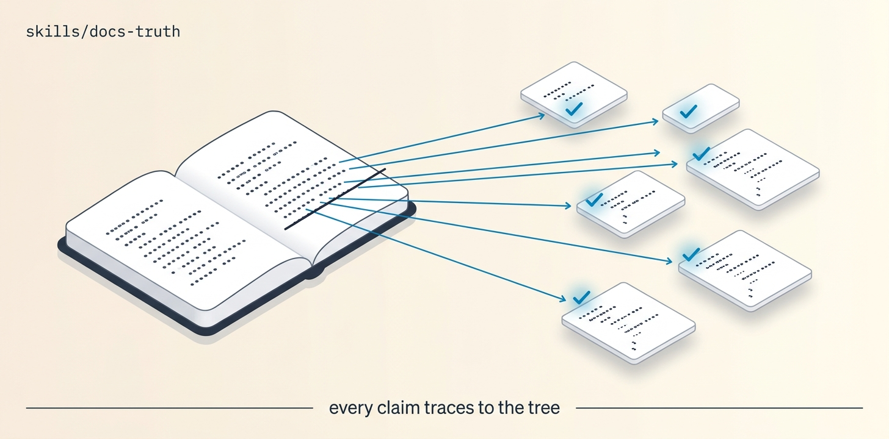

# Docs-Truth

Extract the falsifiable claims from the docs, verify each against the ACTUAL code (does that API/flag/path/example still exist and behave as written? run the examples where possible), fix/regenerate/remove the false ones per Diataxis PR-per-area, and loop until zero claims are untraceable. Truth-first — doc-described-but-unimplemented behavior is a bug routed to backlog-zero, never papered over.

## Install

```bash
ln -sfn "$(pwd)/skills/docs-truth" "$HOME/.claude/skills/docs-truth"
```
Requires Orca + `orchestration`, git + gh, docs and code in one repo, and a docs playbook (addyosmani documentation-and-adrs or gstack document-generate).

## Use

"The README lies — verify and fix it." → extract claims, verify each against file:symbol or a run, correct/regenerate/remove, add traceability anchors. A runnable example whose output doesn't match the doc is FALSE, full stop.

## Structure

```
docs-truth/
├── SKILL.md          # the mission playbook — read top to bottom
├── README.md
├── scripts/          # spawn_worker (calls Orca) · preflight (git/gh) · pm (JSON parser)
├── assets/           # banner + reproducer prompt
└── references/       # ledger template
```

The `scripts/` helpers are GENERATED from this repo's `scripts/orca-coord/` — edit the
canonical files and run `python3 scripts/sync-orca-coord.py`, never the copies.

## License

MIT
