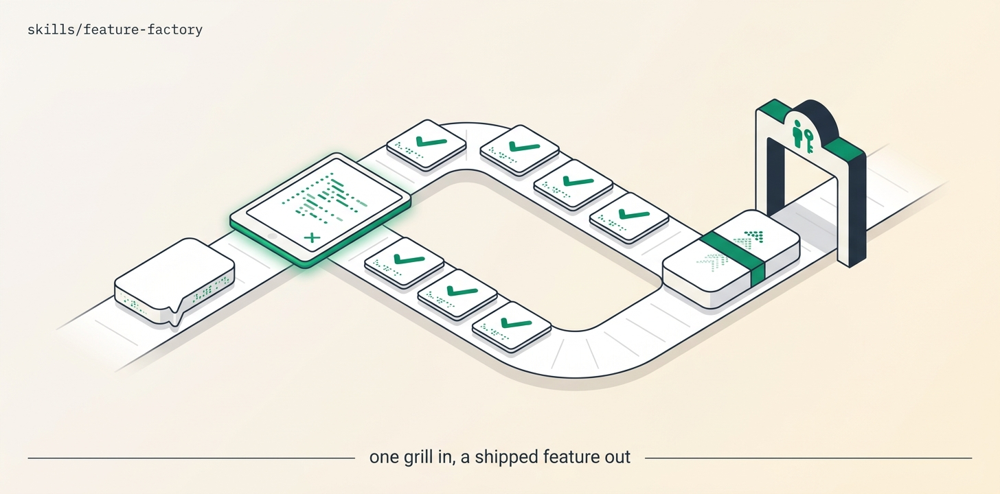

# Feature-Factory

One human grill + spec freeze, then hands-off: spec-decompose to a slice DAG, implement each slice as a tested vertical PR, build-blind review, merge-train onto an integration branch, verify every acceptance criterion against the integrated whole with a traceability table, open the promotion PR behind a human gate, and canary after promotion. Two human touchpoints (freeze, promote); everything between runs unattended.

## Install

```bash
ln -sfn "$(pwd)/skills/feature-factory" "$HOME/.claude/skills/feature-factory"
```
Requires Orca + `orchestration`, git + gh, and a build playbook (Matt grill→spec→tickets→implement→tdd, or Addy DEFINE→BUILD + /build auto).

## Use

"Build and ship the CSV-export feature." → grill you to a frozen spec, decompose, build tested slices, review, merge, verify criteria end-to-end, open the promotion PR for you to merge, then canary. It never self-merges the promotion or deploys — merge ≠ deploy.

## Structure

```
feature-factory/
├── SKILL.md          # the mission playbook — read top to bottom
├── README.md
├── scripts/          # spawn_worker (calls Orca) · preflight (git/gh) · pm (JSON parser)
├── assets/           # banner + reproducer prompt
└── references/       # ledger template
```

The `scripts/` helpers are GENERATED from this repo's `scripts/orca-coord/` — edit the
canonical files and run `python3 scripts/sync-orca-coord.py`, never the copies.

## License

MIT
