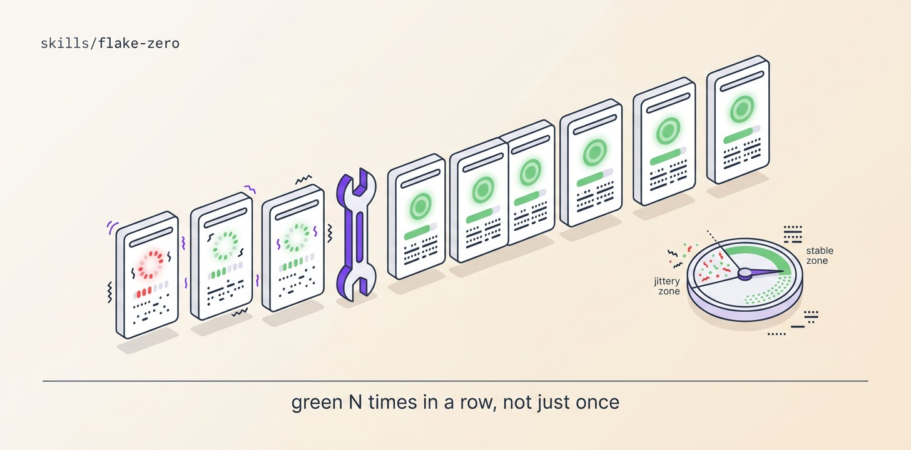

# Flake-Zero

Detect flakes by repeat-running the suite (20×) and mining CI retry history, diagnose each with a loop that RAISES the failure rate (never a theory), fix the root cause and ratchet it red-by-revert, then re-run the whole suite for a consecutive green streak — looping until the streak holds unbroken. Retry-wrappers as fixes are banned and grep-checked.

## Install

```bash
ln -sfn "$(pwd)/skills/flake-zero" "$HOME/.claude/skills/flake-zero"
```
Requires Orca + `orchestration`, git + gh, a runnable suite, and a debugging playbook (mattpocock diagnosing-bugs or addyosmani debugging-and-error-recovery).

## Use

"Deflake the test suite, 10-run streak to call it done." → detect + rank by flake rate, diagnose to a taxonomy class, fix root causes (inject the clock, seed the RNG, isolate state), prove with an unbroken streak. Deterministic N/N failures are bugs — routed to backlog-zero, out of scope here.

## Structure

```
flake-zero/
├── SKILL.md          # the mission playbook — read top to bottom
├── README.md
├── scripts/          # spawn_worker (calls Orca) · preflight (git/gh) · pm (JSON parser)
├── assets/           # banner + reproducer prompt
└── references/       # ledger template
```

The `scripts/` helpers are GENERATED from this repo's `scripts/orca-coord/` — edit the
canonical files and run `python3 scripts/sync-orca-coord.py`, never the copies.

## License

MIT
