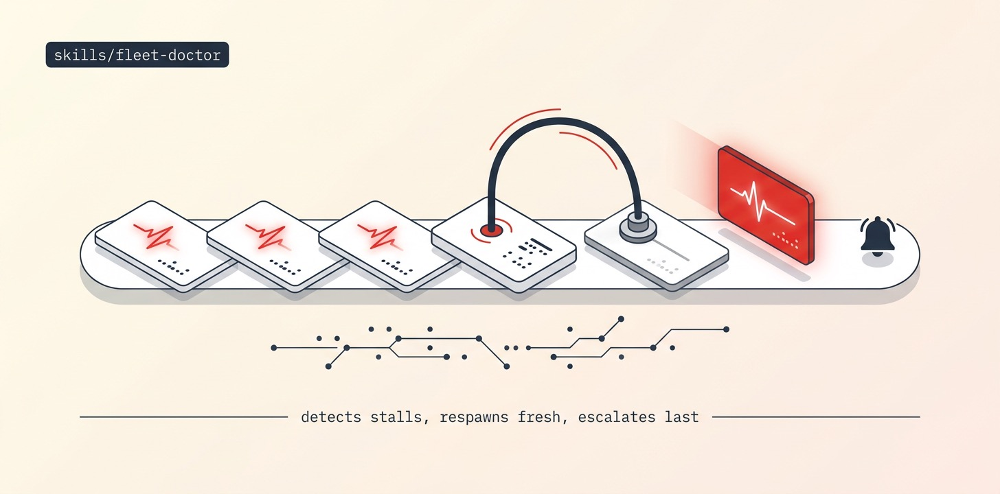

# Fleet-Doctor

Detects stalled dispatches via the runtime's own heartbeat staleness window, nudges paste-not-submitted prompts, respawns dead workers in FRESH terminals with the failure budget the runtime already tracks (circuit breaker at 3), and escalates to a human only when the circuit breaks.

## Install

```bash
ln -sfn "$(pwd)/skills/fleet-doctor" "$HOME/.claude/skills/fleet-doctor"
```
Requires Orca (runtime + `orchestration` CLI skill) and whatever fleet it supervises.

## Use

Run inside any coordinator session: "supervise this run with fleet-doctor". The doctor loop interleaves with the fleet's own waits, keeps a `## Doctor log` in the fleet ledger, and never resets task state by hand — reassignment is a new task with rationale.

## Structure

```
fleet-doctor/
├── SKILL.md          # the agent-facing playbook — read top to bottom
├── README.md
├── scripts/          # spawn_worker (calls Orca) · preflight (git/gh) · pm (JSON parser)
├── assets/           # banner + reproducer prompt
└── references/       # ledger template
```

The `scripts/` helpers are GENERATED from this repo's `scripts/orca-coord/` — edit the
canonical files and run `python3 scripts/sync-orca-coord.py`, never the copies.

## License

MIT
