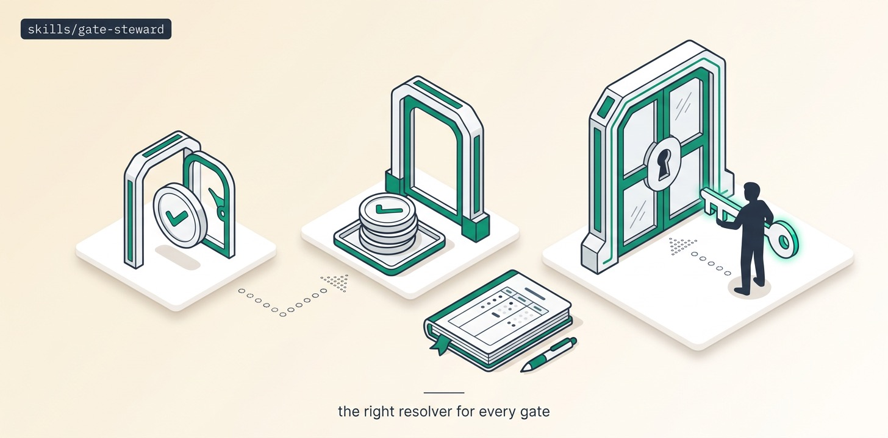

# Gate-Steward

Every gate a fleet raises gets classified before anyone answers: mechanical (steward answers, audited), taste (steward picks + batches one decision-ready brief for human veto), one-way (human only, PARKED on timeout — never defaulted). A per-repo registry makes classifications reusable and one-way lines human-owned.

## Install

```bash
ln -sfn "$(pwd)/skills/gate-steward" "$HOME/.claude/skills/gate-steward"
```
Requires Orca (runtime + `orchestration` CLI skill).

## Use

"Stop pinging me for every naming question" → mechanical gates get audited auto-answers; you read one taste brief per checkpoint; merges/deploys/deletions still wait for you, forever. Works standalone or as autoplan-fleet's decision layer and standing-fleet's between-run gate keeper.

## Structure

```
gate-steward/
├── SKILL.md          # the agent-facing playbook — read top to bottom
├── README.md
├── scripts/          # spawn_worker (calls Orca) · preflight (git/gh) · pm (JSON parser)
├── assets/           # banner + reproducer prompt
└── references/       # ledger template
```

The `scripts/` helpers are GENERATED from this repo's `scripts/orca-coord/` — edit the
canonical files and run `python3 scripts/sync-orca-coord.py`, never the copies.

## License

MIT
