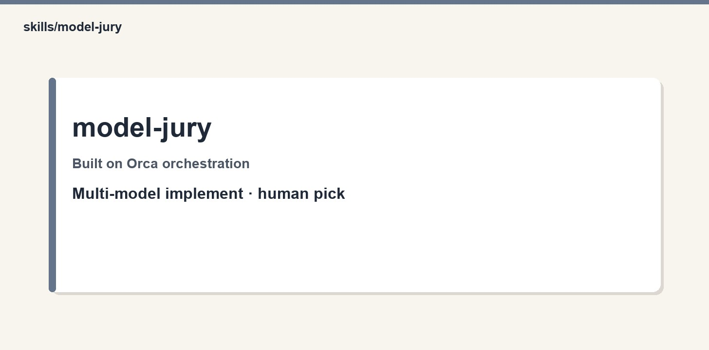

# model-jury

<p align="center">
  
</p>

Same ticket implemented by multiple models; dual-reviewed; human pick (expensive).

## Hard base: Orca (we use it — we don’t replace it)

| Need | Source |
|------|--------|
| Runtime + task/dispatch/`worker_done` | **Orca** |
| Command grammar / lifecycle | **`orchestration` skill (Orca CLI)** — not this repo |
| This playbook | `SKILL.md` in this folder |
| Worker playbooks | [mattpocock/skills](https://github.com/mattpocock/skills) |

If Orca is down or orchestration experimental is off, **stop** — do not fake multi-agent with subagents.

## When to use

*model jury, multi-model implement*

## Install

```bash
git clone https://github.com/ravidsrk/agent-skills.git
cd agent-skills
ln -sfn "$(pwd)/skills/model-jury" ~/.claude/skills/model-jury

# Workers need Matt skills:
npx skills add mattpocock/skills -y

# Orca: install app/CLI, enable orchestration experimental, ensure `orchestration` skill is available
orca status --json
```

## Layout

```
model-jury/
├── SKILL.md
├── README.md
├── scripts/          # spawn_worker, preflight, pm (call Orca)
├── assets/           # role preambles
└── references/       # ledger template + skill-specific refs
```

## Related

matt-ship, review-matrix

Also: `spec-to-ship` / `clean-sweep` (Orca peers, not Matt-based).
