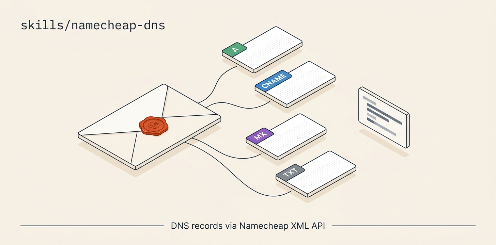

# namecheap-dns

<p align="center">
  
</p>

**Manage DNS records at Namecheap via the XML API** — list, add, update, delete A / AAAA / CNAME / TXT / MX records without going through the Namecheap dashboard.

🟢 **Auth:** `NAMECHEAP_API_KEY` + `NAMECHEAP_API_USER` + IP allowlisting
🟢 **Scope:** DNS records only — for full registrar ops (domain transfers, registration, renewal), use [`clasen/skills@namecheap-domains`](https://skills.sh/clasen/skills/namecheap-domains) instead

# What it does

Namecheap's XML API is functional but has two quirks that bite first-time users:

🔴 **1. IP allowlist required.** Every request must come from a pre-whitelisted IP at *Namecheap → Profile → Tools → Namecheap API Access → Whitelisted IPs*. If your dev environment's IP changes between sessions (cloud sandboxes, mobile, traveling), you'll get error `1011150 Invalid request IP: <ip>` until you add the new IP.

🔴 **2. Updates are wholesale.** There is no "add one record" endpoint. The `setHosts` API REPLACES every record on the domain. You must `getHosts` first, then resend ALL existing records plus your new one in a single call.

This skill handles both quirks transparently.

# When to use it

The skill's `description` triggers on phrases like:

- *"Set up `subdomain.example.com` to point at my Fly app"*
- *"Add a CNAME for `docs.example.com`"*
- *"Update the MX records on `example.com`"*
- *"Link my domain to Vercel / S3 / CloudFront / etc."*
- *"Rotate the SPF/DKIM/DMARC records on this domain"*
- *"What DNS records are set on `example.com`?"*

# Install

# 1. Get the skill

```bash
git clone https://github.com/ravidsrk/agent-skills.git
ln -s "$(pwd)/agent-skills/skills/namecheap-dns" ~/.claude/skills/namecheap-dns
# Or your runtime's skill directory
```

# 2. Set environment variables

```bash
export NAMECHEAP_API_KEY=...           # From Namecheap → Profile → Tools → API Access
export NAMECHEAP_API_USER=your-account # Usually same as your Namecheap username
```

# 3. Enable API access at Namecheap

One-time setup at [ap.www.namecheap.com/settings/tools/apiaccess/](https://ap.www.namecheap.com/settings/tools/apiaccess/):

1. **Turn on API access** (requires a balance ≥ $50 OR ≥ 20 domains OR ≥ $50 lifetime spend)
2. **Whitelist your IP.** Check yours with `curl -s https://api.ipify.org`. Add it under "Whitelisted IPs".

🟡 **Cloud sandboxes:** the IP can change every session. If `1011150 Invalid request IP` shows up, re-check and re-whitelist. The skill auto-prompts when this happens.

# Usage

# List all records on a domain

```bash
MY_IP=$(curl -s https://api.ipify.org)
curl -s -G "https://api.namecheap.com/xml.response" \
  --data-urlencode "ApiUser=$NAMECHEAP_API_USER" \
  --data-urlencode "ApiKey=$NAMECHEAP_API_KEY" \
  --data-urlencode "UserName=$NAMECHEAP_API_USER" \
  --data-urlencode "ClientIp=$MY_IP" \
  --data-urlencode "Command=namecheap.domains.dns.getHosts" \
  --data-urlencode "SLD=example" \
  --data-urlencode "TLD=com"
```

Parse the XML response — each record looks like:

```xml
<host HostId="498699225" Name="www" Type="CNAME"
      Address="example.fly.dev." MXPref="10" TTL="300" />
```

# Add a new record (without losing the others)

Pattern: **getHosts → merge → setHosts**. The skill's `SKILL.md` includes a full bash example that handles the wholesale-replace quirk safely.

Manual sketch:

```bash
# 1. Pull current records (parse XML → JSON)
# 2. Append your new record
# 3. POST setHosts with ALL records (existing + new) as HostName1, RecordType1, Address1, HostName2, ...
```

Concrete `setHosts` shape:

```bash
curl -s -G "https://api.namecheap.com/xml.response" \
  --data-urlencode "ApiUser=$NAMECHEAP_API_USER" \
  --data-urlencode "ApiKey=$NAMECHEAP_API_KEY" \
  --data-urlencode "UserName=$NAMECHEAP_API_USER" \
  --data-urlencode "ClientIp=$MY_IP" \
  --data-urlencode "Command=namecheap.domains.dns.setHosts" \
  --data-urlencode "SLD=example" \
  --data-urlencode "TLD=com" \
  --data-urlencode "HostName1=@"        --data-urlencode "RecordType1=A"     --data-urlencode "Address1=1.2.3.4"     --data-urlencode "TTL1=300" \
  --data-urlencode "HostName2=www"      --data-urlencode "RecordType2=CNAME" --data-urlencode "Address2=example.fly.dev." --data-urlencode "TTL2=300" \
  --data-urlencode "HostName3=api"      --data-urlencode "RecordType3=CNAME" --data-urlencode "Address3=api.example.fly.dev." --data-urlencode "TTL3=300"
  # ...keep going for every existing record
```

🔴 **Forgot a record? It's gone.** Always `getHosts` first.

# Common workflows in the SKILL.md

The full `SKILL.md` covers:

- Linking a custom domain to a Fly app (CNAME + `fly certs add` + verification)
- Setting up Namecheap email forwarding (`eforward1-5.registrar-servers.com` MX records + SPF TXT)
- Pointing email at SES (`feedback-smtp.us-east-1.amazonses.com`)
- Wildcard subdomains (`*.example.com` → app)
- DNSSEC limitations (the public API doesn't expose `domains.dns.dnssec.*`; must be done in the dashboard)

# Known gotchas

- 🔴 **`setHosts` is destructive.** No partial updates — always read all records first.
- 🟡 **MX records need a trailing dot.** `eforward1.registrar-servers.com.` not `eforward1.registrar-servers.com` (notice the `.` at the end). Same for any `Address` value that's a hostname.
- 🟡 **TTL minimum is 60 seconds.** Anything lower gets silently bumped to 60.
- 🟡 **IP allowlist is per-user, not per-API-key.** If you regenerate the API key, the whitelist still applies.
- 🟡 **Sandbox environment is separate.** `api.sandbox.namecheap.com` uses a different account; usually you want `api.namecheap.com` (production).
- 🔴 **DNSSEC via API doesn't work.** We tested every undocumented `domains.dnssec.*` command — `add` exists but rejects all parameter shapes. Use the dashboard.

# File layout

```
namecheap-dns/
├── SKILL.md     ← Manifest + full procedural docs (agent reads this)
└── README.md    ← This file (humans installing the skill)
```

Single-file skill — the API surface is small enough that helper scripts would add more friction than they save.

# Pairs with

- 🔗 **[`cloudflare-dns`](../cloudflare-dns/)** — uses this skill for the registrar-side nameserver flip when migrating to Cloudflare

# License

MIT.
