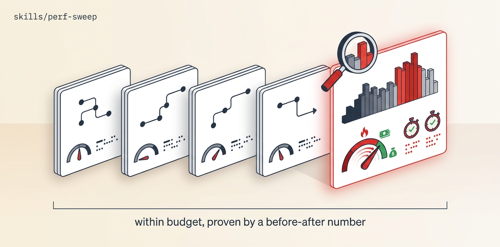

# Perf-Sweep

Baseline each critical journey with real measurement (Core Web Vitals / server timings, twice — perf is noisy), profile to the actual bottleneck, fix PR-per-hotspot with a mandatory before→after number, and re-benchmark with two-consecutive confirmation — looping until every journey is within budget or the residual is parked. Measure-first; guessing at optimizations and fabricating metrics are both banned.

## Install

```bash
ln -sfn "$(pwd)/skills/perf-sweep" "$HOME/.claude/skills/perf-sweep"
```
Requires Orca + `orchestration`, git + gh, a real measurement path (Lighthouse/DevTools or a benchmark harness), and a perf playbook (addyosmani performance-optimization or gstack benchmark).

## Use

"Get the checkout flow under its CWV budget." → baseline ×2, profile the real bottleneck, fix with a before/after in the PR body, confirm across two consecutive post-fix runs, add a CI perf budget so it can't rot. A single fast run is an anecdote, not done.

## Structure

```
perf-sweep/
├── SKILL.md          # the mission playbook — read top to bottom
├── README.md
├── scripts/          # spawn_worker (calls Orca) · preflight (git/gh) · pm (JSON parser)
├── assets/           # banner + reproducer prompt
└── references/       # ledger template
```

The `scripts/` helpers are GENERATED from this repo's `scripts/orca-coord/` — edit the
canonical files and run `python3 scripts/sync-orca-coord.py`, never the copies.

## License

MIT
