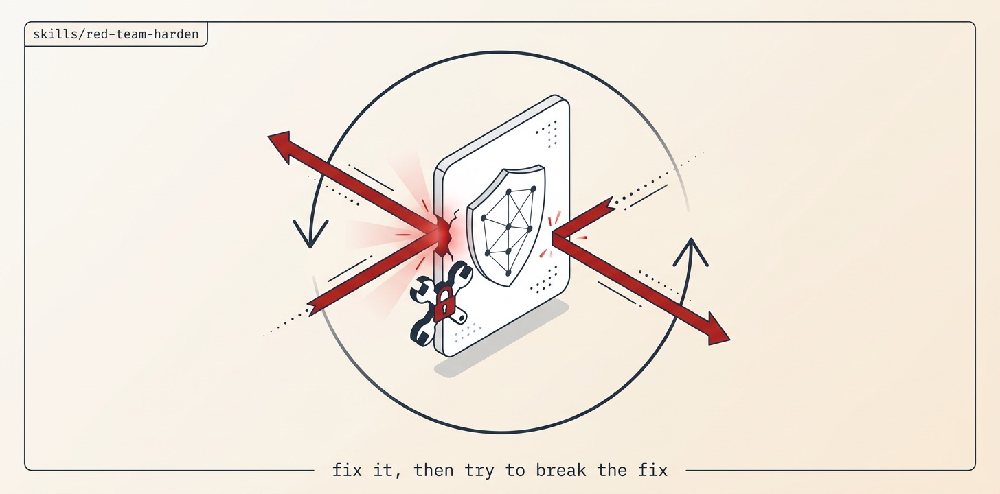

# Red-Team-Harden

STRIDE + OWASP Top 10 + OWASP LLM Top 10 audit → quorum-verified findings → PR-per-fix with a red-capable exploit test → build-blind review → merge-train → an INDEPENDENT red-team worker re-attacks each fix and audits the whole vulnerability class → loops until a fresh full audit finds zero unrefuted P0/P1.

## Install

```bash
ln -sfn "$(pwd)/skills/red-team-harden" "$HOME/.claude/skills/red-team-harden"
```
Requires Orca + `orchestration`, git + gh, gitleaks, and a security worker playbook (addyosmani security-and-hardening or gstack /cso).

## Use

"Harden the payments service, fix P0+P1, LLM surface yes." → threat-model, audit per axis, refute false positives via quorum, fix with exploit tests, re-attack each fix, class-audit, re-audit until clean. Secret leaks route to rotation (human gate), never a silent line-deletion.

## Structure

```
red-team-harden/
├── SKILL.md          # the mission playbook — read top to bottom
├── README.md
├── scripts/          # spawn_worker (calls Orca) · preflight (git/gh) · pm (JSON parser)
├── assets/           # banner + reproducer prompt
└── references/       # ledger template
```

The `scripts/` helpers are GENERATED from this repo's `scripts/orca-coord/` — edit the
canonical files and run `python3 scripts/sync-orca-coord.py`, never the copies.

## License

MIT
