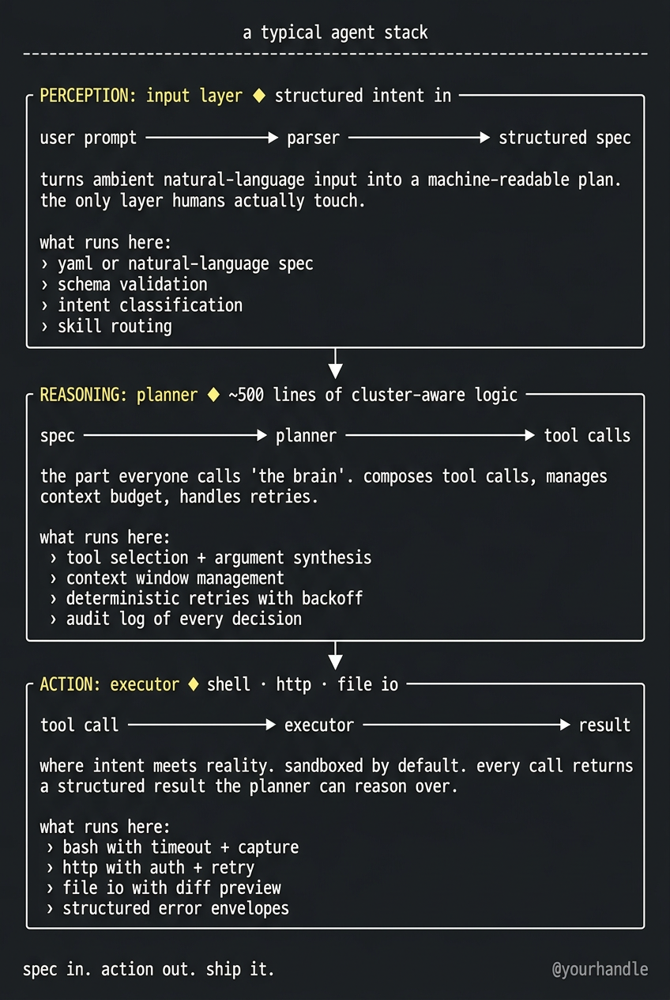
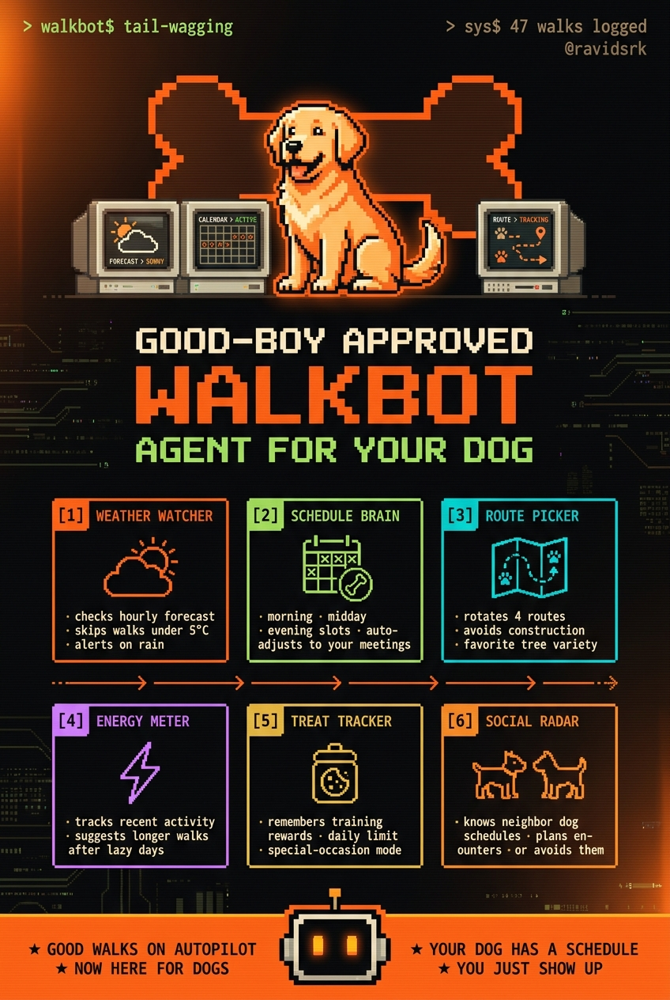
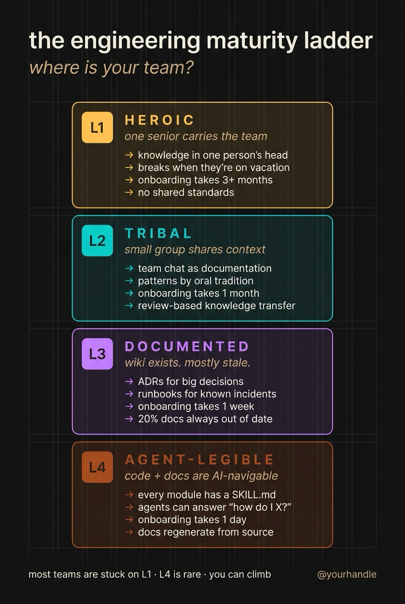

# terminal-poster

Generate dense, retro-cyberpunk infographic posters in a terminal-aesthetic style — the kind of thing that goes viral on X/Twitter for technical product launches, agent architectures, and engineer-poet manifestos.

Five reusable templates. ~$0.002 per image. ~30 seconds end-to-end.

Visual pattern reverse-engineered from public posts by [@shannholmberg](https://x.com/shannholmberg) on X.

---

# Live examples

Three posters below — all generated by running this skill against the example YAML specs in `scripts/example-specs/`. No retouching, no iteration, first-generation output. Audit scores from a Claude vision pass against the canonical signatures (see [`references/worked-examples.md`](references/worked-examples.md) for the audit rubric).

# Cluster A — ASCII Terminal (engineer-poet zine)

> The default. Pure two-tone monochrome. Engineer-poet aesthetic. Best for architecture diagrams and agent stack breakdowns.



🟡 **Score: 68/100** — Structurally on-spec (◆ diamond separators, › quote bullets, "what runs here:" ritual line, ASCII flow diagrams), but the model bled in yellow accents instead of holding pure two-tone. A second iteration would correct it. Honest first-gen output.

Generated with:
```bash
bash scripts/make-poster.sh \
  scripts/example-specs/cluster-a-stack.yaml \
  out.png
```

Spec: [`scripts/example-specs/cluster-a-stack.yaml`](scripts/example-specs/cluster-a-stack.yaml)

---

# Cluster C2 — Cyborg Hero (flat pixel hero)

> The viral format. Top section is a flat 8-bit pixel-art scene + brand wordmark. Bottom section is a 3×2 = 6 product-feature card grid. Best for product launches with a clear hero subject.



🟢 **Score: 92/100** — Hero zone holds flat pixel art (no painterly bleed), exact 3×2 grid, terminal chrome correctly placed in both corners, palette held. One typo in card 6 ("en-ounters" missing a "c"). Excellent first-gen output.

Generated with:
```bash
bash scripts/make-poster.sh \
  scripts/example-specs/c2-smoketest.yaml \
  out.png
```

Spec: [`scripts/example-specs/c2-smoketest.yaml`](scripts/example-specs/c2-smoketest.yaml)

---

# Cluster B — Color-Coded Levels (maturity ladder)

> Semantic palette per level (canonical ramp: L1 amber → L2 teal → L3 magenta → L4 rust → L5 gray). Best for "L1 → L4" maturity ladders, comparison ladders, before/after frameworks.



🟢 **Score: ~95/100** — Regenerated 2026-07-07 after the CLI's null-corruption fix (see `references/worked-examples.md`). Labels, one-liners, and bullets all correct; canonical per-level palette held (amber / teal / magenta / rust). First generation.

Generated with:
```bash
bash scripts/make-poster.sh \
  scripts/example-specs/cluster-b-maturity.yaml \
  out.png
```

Spec: [`scripts/example-specs/cluster-b-maturity.yaml`](scripts/example-specs/cluster-b-maturity.yaml)

---

# Quick start

# 1. Set your OpenRouter key

```bash
export OPENROUTER_API_KEY="sk-or-..."
```

Get one at [openrouter.ai/keys](https://openrouter.ai/keys). The skill uses `google/gemini-3-pro-image` (a.k.a. Nano Banana Pro) at ~$0.002/image.

# 2. Install yq (one-time)

```bash
# macOS
brew install yq

# Linux (needs sudo to write to /usr/local/bin, or drop into ~/.local/bin)
sudo curl -L https://github.com/mikefarah/yq/releases/latest/download/yq_linux_amd64 \
  -o /usr/local/bin/yq && sudo chmod +x /usr/local/bin/yq

# Linux, no sudo:
mkdir -p ~/.local/bin
curl -L https://github.com/mikefarah/yq/releases/latest/download/yq_linux_amd64 \
  -o ~/.local/bin/yq && chmod +x ~/.local/bin/yq
export PATH="$HOME/.local/bin:$PATH"
```

`make-poster.sh` will also auto-install yq on Linux if it's missing. On macOS the script refuses to auto-install and tells you to run `brew install yq` instead.

# 3. Generate a poster

```bash
# --dry-run first: writes ./my-first-poster.prompt.txt without hitting OpenRouter (no credit burn).
bash scripts/make-poster.sh \
  scripts/example-specs/cluster-a-stack.yaml \
  ./my-first-poster.png --dry-run

# Happy with the prompt? Drop --dry-run to render.
bash scripts/make-poster.sh \
  scripts/example-specs/cluster-a-stack.yaml \
  ./my-first-poster.png
```

~30 seconds later you'll have a PNG.

---

# How to write a spec

Every poster is driven by a YAML spec. Pick a cluster based on what you're communicating:

| Cluster | When to use | Vibe |
|---|---|---|
| **A** ASCII Terminal | architecture diagrams, agent stacks, system breakdowns | engineer-poet zine, brutalist, two-tone |
| **B** Color-Coded | maturity ladders, comparison levels, before/after | semantic palette per level |
| **C1** Painterly Hero | viral product launches, founder posts | cinematic hero illustration + 6-card grid |
| **C2** Pixel Hero | whimsical product launches, mascot-driven brands | flat 8-bit hero + 6-card grid |
| **D** Blueprint | step-by-step playbooks, deploy guides, workflows | numbered steps, blueprint chrome |
| **E** Editorial | brand books, manifestos, founder essays | high-end magazine, large type |

The simplest spec — Cluster A with 3 panels — looks like this:

```yaml
cluster: a
title: a typical agent stack
bottom_tagline: "spec in. action out. ship it."
handle: "@yourhandle"

panels:
  - label: PERCEPTION
    subject: input layer
    tagline: structured intent in
    flow: "user prompt ──▶ parser ──▶ structured spec"
    prose: "turns ambient natural-language input into a machine-readable plan."
    items:
      - "yaml or natural-language spec"
      - "schema validation"
      - "intent classification"
      - "skill routing"

  - label: REASONING
    subject: planner
    # ... etc
```

See [`scripts/example-specs/`](scripts/example-specs/) for one full spec per cluster.

For the full template reference (every placeholder, every visual rule, every failure mode), see [`SKILL.md`](SKILL.md) and the [`references/templates/`](references/templates/) directory.

---

# What you get

Every successful generation produces two files:

```
your-poster.png             ← the rendered image
your-poster.prompt.txt      ← the exact prompt sent to the model (for reproducibility)
```

The `.prompt.txt` is your audit trail. If something looks wrong, you can edit the prompt directly and re-run via `scripts/generate.sh`.

---

# Cost & speed

| | |
|---|---|
| Per image | ~$0.002 (Nano Banana Pro via OpenRouter) |
| Time per image | ~30 seconds |
| Typical session (3 iterations) | ~$0.006 |
| First-generation success rate | 68–99% depending on cluster |

Cluster A and C2 are the most reliable. Cluster B holds the canonical amber/teal/magenta/rust ramp because the CLI hard-codes the per-L hex codes into the prompt. See [`references/worked-examples.md`](references/worked-examples.md) for the full iteration log + failure modes catalogued.

---

# Files in this skill

```
terminal-poster/
├── README.md                              ← this file
├── SKILL.md                               ← agent-readable skill specification
├── scripts/
│   ├── make-poster.sh                     ← high-level CLI (YAML spec → PNG); supports --dry-run
│   ├── generate.sh                        ← low-level helper (prompt.txt → PNG)
│   └── example-specs/
│       ├── cluster-a-stack.yaml           ← Cluster A engineer-poet zine
│       ├── cluster-b-maturity.yaml        ← Cluster B color-coded ladder
│       ├── cluster-c1-hero.yaml           ← Cluster C1 painterly hero
│       ├── c2-smoketest.yaml              ← Cluster C2 whimsical pixel hero
│       ├── cluster-d-playbook.yaml        ← Cluster D1 blueprint playbook
│       ├── cluster-d2-thought-piece.yaml  ← Cluster D2 terminal-window
│       └── cluster-e-brandbook.yaml       ← Cluster E editorial brand book
├── references/
│   ├── design-dna.md                      ← palette, fonts, layout rules
│   ├── worked-examples.md                 ← iteration log, scores, failure modes
│   └── templates/
│       ├── cluster-a-ascii-terminal.md
│       ├── cluster-b-color-coded.md
│       ├── cluster-c-cyborg-hero.md
│       ├── cluster-d-blueprint.md
│       └── cluster-e-editorial.md
└── assets/
    └── examples/                          ← 7 rendered posters + their .prompt.txt trails (one per cluster/sub-mode)
```

---

# Critical pitfalls (must-read)

🔴 **Forbid the word "PERIOD" explicitly.** The model spells it out as filler text in tagline bars even when given literal `.` examples. The skill's prompt templates already include the text-rules block — don't strip it.

🔴 **Always specify EXACT grid dimensions for Cluster C.** Say "EXACTLY a 3 columns × 2 rows = 6 cards" — not "6 cards in a grid". Otherwise you'll get 4+3 asymmetric layouts.

🔴 **Use OpenRouter, not direct Google API.** The default Google `GOOGLE_GENERATIVE_AI_API_KEY` is project-blocked → 403. OpenRouter is the reliable path.

🟡 **Brand names with short letters** (e.g. "Polymarket") sometimes get a single glyph corrupted. If brand name is critical, plan one regeneration.

🟢 **Cluster A is the cheapest to nail.** Pure ASCII, two-tone, easy for the model. Default to it.

Full list in [`SKILL.md`](SKILL.md) under "Critical pitfalls".

---

# Credits

Visual pattern reverse-engineered from [@shannholmberg](https://x.com/shannholmberg) on X. He didn't design this skill — he designed the look. This skill just makes the look reproducible across topics.

# Pairs with

- [`deep-research`](../deep-research/) — research a topic, then render the findings as a poster.

# License

MIT. See the repo-level [LICENSE](../../LICENSE).
