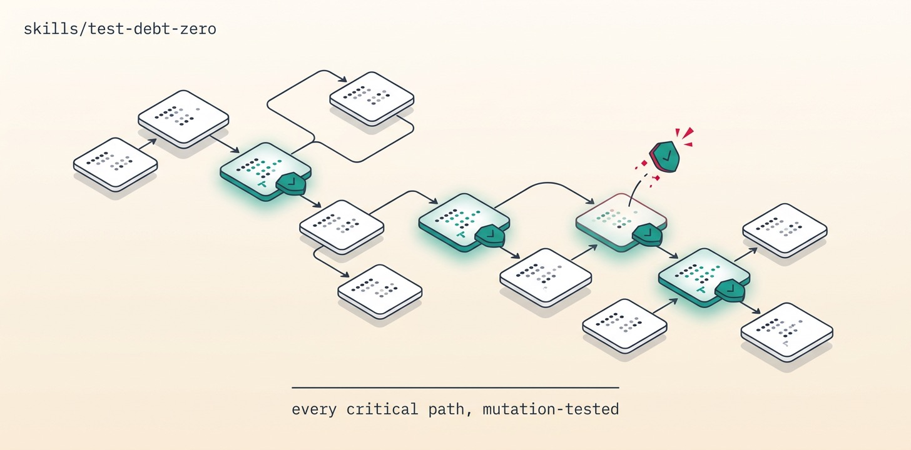

# Test-Debt-Zero

Map the untested critical surface (coverage × call-graph of the money/auth/data paths), write failing-first tests that assert real behavior, prove each one earns its keep by going RED when its production code is reverted, and route surfaced bugs to a fix or backlog — looping until every confirmed critical path is revert-audited. Coverage percent is a proxy; the revert-check is the truth.

## Install

```bash
ln -sfn "$(pwd)/skills/test-debt-zero" "$HOME/.claude/skills/test-debt-zero"
```
Requires Orca + `orchestration`, git + gh, a runnable suite + coverage tool, and a TDD playbook (addyosmani or mattpocock — one router per worker).

## Use

"Close the test gap on the payments and auth paths." → map the critical surface (human-confirmed to bound it), characterize with real assertions, revert-audit each test RED, and hand surfaced bugs to backlog-zero. A green test over reverted code is worthless and the mission knows it.

## Structure

```
test-debt-zero/
├── SKILL.md          # the mission playbook — read top to bottom
├── README.md
├── scripts/          # spawn_worker (calls Orca) · preflight (git/gh) · pm (JSON parser)
├── assets/           # banner + reproducer prompt
└── references/       # ledger template
```

The `scripts/` helpers are GENERATED from this repo's `scripts/orca-coord/` — edit the
canonical files and run `python3 scripts/sync-orca-coord.py`, never the copies.

## License

MIT
